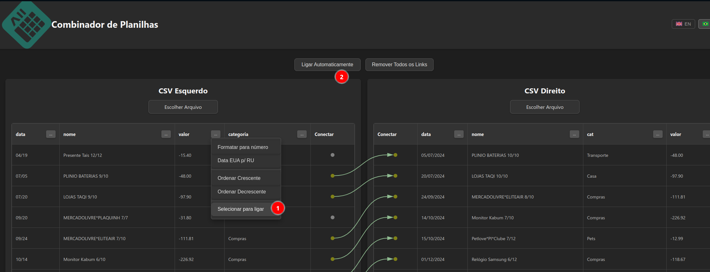

# Conector de Planilhas

Este site permite realizar a comparação manual entre 2 tabelas, ligando linhas de uma tabela à linhas de outra.

## Funcionalidades

- **Suporte a CSV**: Carregue arquivos CSV tradicionais
- **Suporte a OFX**: Carregue arquivos OFX (Open Financial Exchange) e eles serão automaticamente convertidos para o formato tabular
- **Ligação Manual**: Conecte manualmente linhas entre as duas tabelas
- **Ligação Automática**: Use colunas específicas para criar ligações automáticas entre registros correspondentes
- **Formatação de Dados**: Formate números e datas para facilitar a comparação
- **Interface Multilíngue**: Suporte para Português e Inglês

## Tipos de Arquivo Suportados

### CSV
Arquivos de valores separados por vírgula padrão.

### OFX (Open Financial Exchange)
Arquivos OFX são automaticamente processados e convertidos para formato tabular com as seguintes colunas:
- **date**: Data da transação
- **amount**: Valor da transação
- **type**: Tipo da transação (DEBIT/CREDIT)
- **description**: Descrição da transação
- **fitid**: ID único da transação
- **checknum**: Número do cheque (se aplicável)
- **refnum**: Número de referência

https://tales-k.github.io/spreadsheet-connector/

